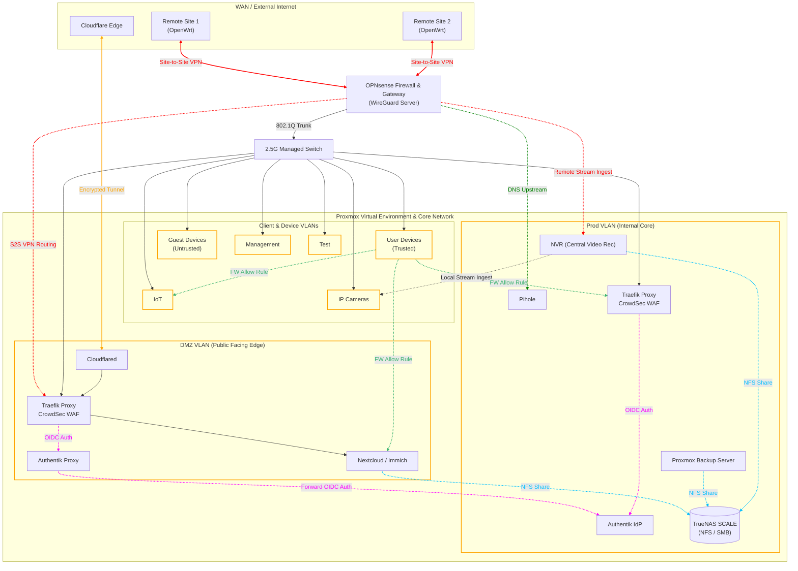

# IaC

# ☁️ Cloud-Native Homelab & Infrastructure as Code

[](#)
[](#)
[](#)
[](#)
[](https://github.com/john-fotis/iac/actions)
[](https://github.com/john-fotis/iac/issues)
[](https://github.com/john-fotis/iac/pulls)

A declarative, GitOps-driven infrastructure repository managing a highly available, enterprise-grade homelab environment. This project provisions, configures, and secures physical hosts, virtual machines, networking appliances, and containerized workloads using industry-standard DevOps tools.

## 📂 Repository Structure

The repository is modularized to strictly separate configuration management, secrets, and application workloads.

```text
.
├── ansible/                  # Configuration management & host bootstrapping
│   ├── inventories/          # Environment variables and host groups
│   └── roles/
│       ├── host-init-setup/  # Base OS hardening, SSH keys, user setup
│       ├── mount-nfs/        # TrueNAS storage backend integration
|       .
|       .
|       .
│       └── docker-gitops/    # Automated Docker runtime and service deployment
├── docker/                   # Containerized service stacks
│   ├── secrets/              # SOPS-encrypted environment variables for each environment
│   │   ├── prod/             # `prod` environment secrets
│   │   ├── dmz/              # `dmz` environment secrets
│   │   └── test/             # `test` environment secrets
│   └── services/             # Docker workload definitions
│       ├── authentik/        # Authentik Compose file
│       ├── traefik/          # Traefik Proxy Compose & config files
|       .   └── config        # Dynamic Traefik configuration via the file provider
|       .       ├── common    # Common configuration files for all environments
|       .       ├── dmz       # `dmz` configuration files
|       .       └── prod      # `prod` configuration files
│       .
│       .
│       └── socket-proxy/     # Docker Socket Proxy compose files
|           ├── dmz           # Compose file for `dmz` environment
|           └── prod          # Compose file for `prod` environment
├── networking/               # Edge network configs (eg. Tailscale ACLs & Network VLAN reservations)
└── packer/                   # Immutable base image templates for Proxmox
```

# 🏗️ Infrastructure as Code Homelab

Welcome to the central repository for my self-hosted, cloud-native homelab. What began as a collection of self-hosted applications has evolved into a strict, declarative Infrastructure-as-Code (IaC) repository built to simulate enterprise-grade, high-availability data center operations on personal hardware.

This repository controls the end-to-end lifecycle of the infrastructure: from baking base OS images and instantiating hypervisor VMs, to configuring networks, securing secrets, and orchestrating containerized microservices.

## 📐 Architecture & Network Segmentation

The homelab operates on a heavily segmented network topology managed by an **OPNsense** edge firewall. Environments are isolated via VLANs to enforce strict access controls between public-facing services and internal production workloads.



- **PROD VLAN:** Hosts internal core services such as IDP, databases, the core monitoring stack, TrueNAS, management APIs and more.
- **DMZ VLAN:** Hosts externally accessible services like Nextcloud & Immich as well as the public-facing authentication proxy.
- **IOT VLAN:** Includes Internet of Things devices, allowing **only** internet access. All other outgoing traffic is blocked. Incoming access is acceptable only from USER VLAN (mDNS) and PROD VLAN (Home Assistant).
- **TEST VLAN:** Ephemeral environment for staging updates and testing deployments.
- **IPCAM VLAN:** A totally isolated VLAN for maximum stream security, allowing only incoming connection from the NVR which is on PROD VLAN.
- **USER VLAN:** User Personal devices are conected here, granted internet access as well as some internal services access.
- **GUEST VLAN:** Guest personal devices, permitted only to access the public internet with some limitations.
- **MGMT VLAN:** Critical management interfaces live on this VLAN. These include ISP Modem Management Console, PVE UI, Managed Switch Console, OPNSense Admin Dashboard etc.

## 🐳 Service deployment with dynamic Docker stacks

All docker services are defined in a homonym directory under the `docker/services` and consists of at least one `compose.yaml` file. They might also include some configuration files under the same folder and secrets under the `docker/secrets` directory. At the root of the `docker` directory, there is a docker-compose-`env_name`.yaml and a env.`env_name`. For example the `prod` environment is defined by the `docker-compose-prod.yaml` and `env.prod`, which is deprypted from `env.sops.prod`. The master compose file includes all the sub-compose files and the secrets the services need. It also defines the networks required for Traefik Proxy, Socket Proxy, Databases etc. For more information about the Docker Stacks implementation see the [Docker Directory Documentation](./docker/README.md).

## 🔒 Edge Security & Ingress Flow

Exposing services to the public internet is handled with a defense-in-depth approach. No ports are forwarded directly to the internet.

### The Ingress Pipeline

1.  **Cloudflare Tunnel:** External traffic hits a Cloudflare Tunnel. Cloudflare acts as the first layer of defense, restricting access via IP whitelisting, bot protection, and optional CF Access authentication.
2.  **IP Verification:** Requests are forwarded to the DMZ. The reverse proxy strictly validates that incoming requests originate _only_ from verified Cloudflare IPs.
3.  **Traefik Proxy (DMZ):** The DMZ environment runs an isolated instance of Traefik. It terminates TLS and routes traffic to the required service.
4.  **Authentik (OIDC):** Before a user reaches Nextcloud or Immich, Traefik forwards the request to an Authentik Proxy (running in the DMZ), which communicates securely with the core Authentik IdP (running in Prod) through strictly permitted firewall ports.

### Dual Traefik & Socket Proxy Architecture

To achieve maximum isolation, the environment runs **two completely separate Traefik instances**:

- **Traefik DMZ:** Handles public traffic and external services.
- **Traefik Prod:** Handles internal-only routing for core infrastructure.

Neither Traefik instance has direct access to the `docker.sock`. Instead, each environment utilizes a dedicated **Docker Socket Proxy** (e.g., `tecnativa/docker-socket-proxy`). This completely prevents privilege escalation attacks, as the proxy strictly filters API requests, granting Traefik read-only access to container labels and dropping all execution capabilities.

Furthermore, both environments are protected by independent **CrowdSec** instances, which parse Traefik logs locally and ban malicious IPs or aggressive scanners at the proxy layer.

## 🔑 Secrets Management (SOPS + Age)

This repository is public, but all sensitive data (API tokens, database passwords, OAuth secrets) is heavily encrypted.

I utilize **Mozilla SOPS** combined with **Age**. Secrets are stored alongside the configuration code in the `docker/secrets/` directory. The entire operational environment can be decrypted and deployed using a single, heavily safeguarded Age private key. This provides maximum security while preserving the convenience of full GitOps tracking.

More information about this topic available at [SOPS Directory Documentation](.sops/README.md).

## 🌐 VPN & Zero-Trust Remote Access

Remote access is governed by two distinct VPN architectures, bypassing the need to expose management ports.

- **Site-to-Site WireGuard VPN:** The OPNsense firewall serves as a WireGuard server connecting two OpenWrt routers at remote locations. This creates a seamless mesh where remote clients can access DMZ resources without traversing the CF tunnel or triggering 2FA. Conversely, the homelab reaches back into those networks to capture remote IP camera streams for the centralized NVR.
- **Tailscale Overlay (Zero-Trust):** For administrative access, a Tailscale subnet router is deployed in each VLAN, alongside a primary Bastion node on the LAN. Fine-grained Tailscale ACLs restrict user access to specific IP/port combinations, enforcing zero-trust without requiring individual machine configurations.

## 📊 Observability & Notifications

- **Monitoring:** The core monitoring stack lives in Prod, featuring **Prometheus** (time-series data) and **Grafana** (visualization). **Node Exporter** runs across all environments and feeds back into the main Prometheus instance.
- **Hypervisor Telemetry:** **Pulse** and **Beszel** run in isolated LXC containers to provide real-time, deep-dive metrics on Proxmox VMs and host hardware.
- **Alerting Pipeline:** Critical alerts are routed to Discord webhooks.
- **SMTP Gateway:** Applications requiring standard email outputs (Nextcloud passwords, Authentik notifications) currently route through Mailgun's free tier. _(Future implementation: Mailrise to intercept SMTP and push to Apprise for unified Discord notifications without external mail dependencies)._

## 💾 Storage & Automated Backups

- **TrueNAS SCALE:** Resides in the Prod VLAN. DMZ services that require heavy storage (Nextcloud, Immich) mount TrueNAS datasets via NFS/SMB. These shares are strictly locked down by target IP restrictions and dedicated service credentials.
- **Proxmox Backup Server (PBS):** To conserve power, the PBS VM is highly automated. It is scheduled to power up every night, execute incremental backups of all VMs/LXCs directly to the NAS, verify data integrity, and gracefully shut down immediately upon completion.

## 🚀 Provisioning Pipeline

The infrastructure is completely declarative and follows a 3-stage bootstrapping process:

1.  **Packer:** Bakes immutable Ubuntu/Debian OS templates on Proxmox, injecting Cloud-Init configurations.
2.  **Terraform:** Connects to the Proxmox API to dynamically instantiate VMs and LXCs based on defined states.
3.  **Ansible:** Takes over the raw machines, configures the OS, establishes security baselines, mounts network storage, installs Docker runtimes, and manages the GitOps sync (`ansible/`).

For detailed information on the automation and configuration management layer, see the [Ansible Directory Documentation](./ansible/README.md).
